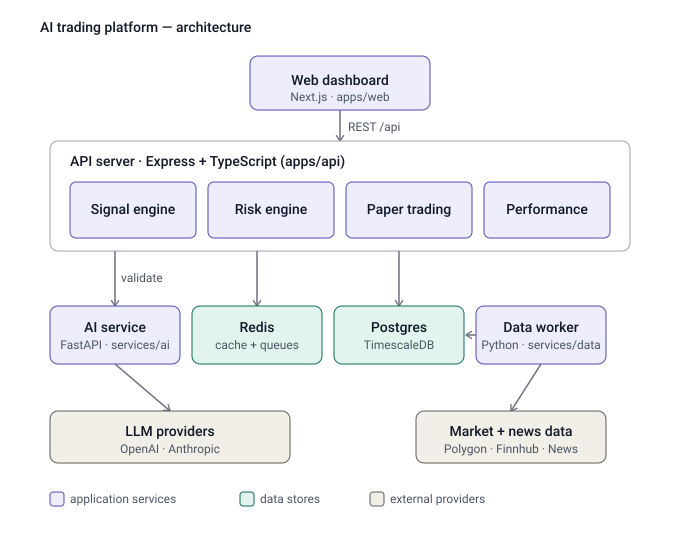

# Architecture

AI trading intelligence platform — a monorepo that ingests market data, detects trade
signals, validates them through a risk engine and an LLM, paper-trades the result, and
surfaces everything on a dashboard.



## Overview

The system is split into four application services backed by two data stores and a set of
external providers:

| Layer | Component | Stack | Location |
|-------|-----------|-------|----------|
| Frontend | Web dashboard | Next.js 14 (App Router) | `apps/web` |
| Backend | API server | Node.js + Express + TypeScript | `apps/api` |
| AI | Analysis service | Python + FastAPI | `services/ai` |
| Ingestion | Data worker | Python | `services/data` |
| Storage | Time-series + relational DB | PostgreSQL + TimescaleDB | (Docker) |
| Storage | Cache + queues | Redis | (Docker) |

Shared TypeScript types live in `packages/shared`.

## Components

### Web dashboard (`apps/web`)

A Next.js client that renders the trading view chart, indicator sidebar, signals table,
and performance card. It holds no business logic — it reads from the API over REST
(`NEXT_PUBLIC_API_URL`) and polls with SWR (e.g. the performance card refreshes every 30s).

### API server (`apps/api`)

The core of the platform. Express app (`src/app.ts`) with `helmet`, `cors`, `morgan`, and
JSON middleware, exposing `/health` and an `/api` router. Routes: `candles`, `symbols`,
`signals`, `performance`, and `health`. It owns four internal modules:

- **Signal engine** (`src/signals/`) — runs the strategy on a schedule. It reads candles
  and indicators from Postgres, applies the strategy thresholds (RSI band, ATR floor,
  ATR-based stop/target multiples), and calls the AI service to score the setup. A signal
  is only generated when the AI score clears `AI_MIN_SCORE` (70), subject to a cooldown.
- **Risk engine** (`src/risk/riskEngine.ts`) — validates every prospective trade before
  execution. Per project rules, this must be called before any trade is executed.
- **Paper trading** (`src/execution/`) — simulates execution and manages open positions on
  a schedule.
- **Performance service** (`src/services/performance.ts`) — aggregates closed trades into
  total trades, win rate, total PnL, max drawdown, and average RR, served at
  `/api/performance`.

Persistence goes through Prisma (`src/lib/prisma.ts`) to Postgres; Redis (`src/lib/redis.ts`)
is used for caching and queues.

### AI analysis service (`services/ai`)

A FastAPI service exposing an `/analyze` router with three endpoints:

- `POST /analyze/market-context` — structured market briefing from price action + news.
- `POST /analyze/validate-signal` — scores and approves/rejects a candidate signal.
- `POST /analyze/journal-review` — reviews journaled trades.

Each endpoint pairs a system prompt with a typed request/response schema and calls an LLM
provider (OpenAI or Anthropic). The API reaches it at `AI_SERVICE_URL`
(default `http://localhost:8000`).

### Data worker (`services/data`)

A standalone Python worker responsible for ingesting market data from providers (Alpha
Vantage, Polygon, Finnhub, etc.) and writing candles into Postgres, decoupled from the API.

> Note: `worker.py` is currently a stub (`print("data worker starting")`). Ingestion logic
> is not yet implemented.

## Data model (Prisma)

`Candle`, `Indicator`, `NewsEvent`, `Signal`, `Trade`, `Journal`, `RiskLog`, plus enums
`Impact`, `Direction`, `SignalStatus`, `TradeStatus`.

## Data flow

1. The **data worker** pulls OHLCV candles and news from external providers into Postgres
   (TimescaleDB hypertables for time-series).
2. The **signal engine** reads recent candles/indicators, applies the strategy, and asks
   the **AI service** to validate the setup. Approved setups become `Signal` rows (journaled
   with reasoning).
3. The **risk engine** validates a signal before it can be traded; outcomes are written to
   `RiskLog`.
4. **Paper trading** opens/manages positions and records `Trade` rows.
5. The **performance service** aggregates closed trades; the **web dashboard** reads signals,
   candles, and performance over REST.

## Infrastructure & local dev

Docker Compose provisions the stateful infrastructure only:

- `postgres` — `timescale/timescaledb:latest-pg16` (port 5432)
- `redis` — `redis:7-alpine` with append-only persistence (port 6379)

The application services run from the host during development:

```bash
docker compose up -d                         # start postgres + redis
npm run dev:api                              # API server
npm run dev:web                              # Next.js dashboard
cd services/ai && uvicorn main:app --reload  # AI service
```

Configuration is environment-driven (`.env`, see `.env.example`): database/redis URLs,
service hosts/ports, JWT/session secrets, LLM provider keys (`OPENAI_API_KEY`,
`ANTHROPIC_API_KEY`), and market-data/news provider keys.

## Operating rules

These invariants are enforced across the codebase (see `CLAUDE.md`):

- The risk engine must be called before any trade execution.
- API keys are never hardcoded — always loaded from `.env`.
- Every trade signal is journaled with its reasoning.
- Every strategy is backtested before live use, and paper-traded before real money.
