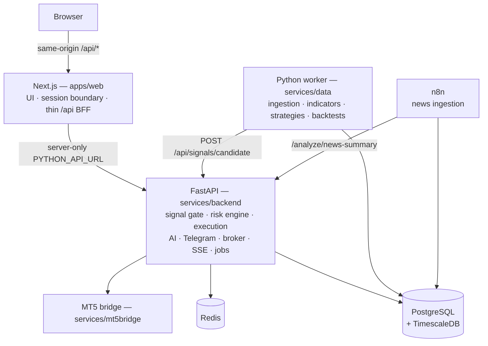

# Architecture

AI trading intelligence platform — a monorepo that ingests market data, detects
trade signals, validates them through a risk engine and an LLM, paper- or
live-trades the result, journals every outcome, and surfaces it on a dashboard.

**Two application frameworks** (see
`docs/plans/11-nextjs-python-consolidation.md`):

1. **Next.js** — dashboard, the session/auth boundary, and a thin same-origin
   backend-for-frontend (BFF).
2. **Python / FastAPI** — every trading-domain concern: database and Redis
   access, signal validation, the authoritative risk engine, paper/live
   execution, AI orchestration, Telegram and broker integrations, realtime, and
   the scheduled jobs.

> `docs/architecture.svg` and `architecture-v2.html` predate the consolidation
> and still show the Express API and a separate AI service. The diagram below is
> the current shape.

## Overview



| Service | Technology | Responsibility |
|---|---|---|
| `web` | Next.js 14 (App Router) | UI, session/auth boundary, BFF proxy |
| `backend` | Python + FastAPI | Domain API, risk, execution, AI, jobs, realtime |
| `worker` | Python | Ingestion, indicators, strategies, backtests |
| `mt5bridge` | Python + FastAPI | Windows/MT5 terminal adapter (`live` profile) |
| `postgres` | PostgreSQL + TimescaleDB | Durable state |
| `redis` | Redis | Cache, pub/sub, distributed locks |
| `n8n` | n8n | Economic-calendar and headline ingestion |
| `api` | Express + Prisma | **Legacy.** Rollback path only (`legacy` profile) |

Shared TypeScript types live in `packages/shared`.

## Ownership boundaries

### Next.js owns

Dashboard routes and presentation state; user authentication and session cookies
when auth is added; CSRF and request-level authorization; same-origin API
proxying. It holds **no** database, broker, Telegram or LLM credentials, and
contains no second risk engine.

The proxy is `apps/web/app/api/[...path]/route.ts`. It forwards method, path,
query, body and an allowlisted set of headers to `PYTHON_API_URL` — a server-only
variable, deliberately not `NEXT_PUBLIC_`, guarded by a module-load check in
`apps/web/lib/server/backend.ts`. `/api/stream` is streamed through unbuffered so
the dashboard's `EventSource` keeps working.

### FastAPI owns

All PostgreSQL and Redis access; every domain write and transaction; signal
candidate validation and idempotency; the single authoritative risk engine;
execution mode resolution, kill switch, circuit breakers and portfolio caps;
paper trading and live MT5 execution; trade journaling and AI review; the
background schedules; AI provider selection and calls; Telegram webhooks and
broker credential encryption; SSE events and internal worker callbacks.

### The Python worker owns

Candle ingestion and indicator calculation; strategy evaluation and candidate
construction; backtesting. It may submit candidates, but it never creates a
`Signal` or `Trade` directly.

## The decision path

This is the part to understand before changing anything.

```
strategy candidate
      │
      ▼
POST /api/signals/candidate ────────────► RawSignal recorded (observe-only,
      │                                    only while the raw_signal_feed flag
      │                                    is on; no path to a Trade)
      ▼
gate (domain/signals/gate.py)
      ├─ idempotency (clientId)      → skipped: idempotent_duplicate
      ├─ cooldown                    → skipped: cooldown_active
      ├─ candle sufficiency (>= 10)  → skipped: insufficient_candles=N
      ├─ AI validation               → rejected: ai_score_too_low | ai_not_approved
      │                                skipped:  ai_service_unreachable (fails closed)
      ├─ resolve config              SYMBOL ► STRATEGY ► GLOBAL ► code defaults
      ├─ RISK ENGINE                 → rejected: risk_rejected: <joined reasons>
      │  (position size, RR, daily loss, drawdown,
      │   two-sided news window, gold guards)
      │  …always writes a RiskLog row, approved or not
      ▼
Signal persisted (PENDING)
      │
      ▼
decider (domain/execution/policy.py) — can only HOLD or ROUTE, never loosen
      ├─ breaker tripped today?      → held_off  (overrides AUTO and CONFIRM)
      ├─ mode OFF                    → held_off
      ├─ portfolio caps              → blocked   (open trades, open risk, per-currency)
      ├─ mode AUTO                   → open paper or live trade
      └─ mode CONFIRM                → Approval + Telegram card
                                          │
                                          ▼
                                   human taps Approve → risk re-sizes, trade opens
```

Every closed trade — paper or live, closed by us or by the broker — goes through
one journaling path, so a closed `Trade` cannot exist without its `Journal`.

## Data model

Owned by `services/backend/app/db/models.py`, over the schema the Prisma
migrations created (same table and column names):

`Candle`, `Indicator`, `NewsEvent`, `Strategy`, `Signal`, `Trade`, `Journal`,
`RiskLog`, `RiskConfig`, `ExecutionSetting`, `ConfigAudit`, `BacktestRun`,
`BrokerCredential`, `AgentRecommendation`, `Approval`, `RawSignal`,
`FeatureFlag`; enums `Impact`, `Direction`, `SignalStatus`, `TradeStatus`,
`ExecutionMode`, `ApprovalStatus`, `RawVerdict`.

Timestamps are `TIMESTAMP(3)` **without** time zone and hold naive UTC;
`app/jobs/clock.py` is the single seam that converts between naive and aware.

### Migrations

Alembic is authoritative (`services/backend/migrations`). Its baseline revision
*adopts* the existing schema: it detects a live `Candle` table and no-ops, so
running it against production stamps the version without touching a row; on a
fresh database the same revision builds everything from the models.
`alembic revision --autogenerate` must produce an empty diff, and
`tests/test_schema_drift.py` fails the build if it doesn't.

The Prisma SQL history stays in `apps/api/prisma/migrations` as the archive of
how the schema got here, and `_prisma_migrations` is left untouched so a rollback
to Express can still run `prisma migrate deploy`.

## Configuration layer

Runtime-controllable risk and execution settings resolve most-specific-wins:

```
SYMBOL ► STRATEGY ► GLOBAL ► code defaults (domain/config/defaults.py)
```

Risk fields layer **per field** (a null falls through to the next scope); the
execution mode takes the most specific whole row. A row with `enabled = false` is
ignored entirely. Rows are cached in Redis and the cache is busted on write.

Every mutation is bounds-checked against `RISK_BOUNDS`, appends a `ConfigAudit`
row naming the actor, and busts the cache — whether it came from the dashboard,
a Telegram command, or an approved agent recommendation. The agent's own bounds
are deliberately narrower than the human's: an agent can nudge a value, only a
human can floor it, and `AUTO` is never agent-proposable.

## Realtime

`GET /api/stream` is Server-Sent Events: an `event: hello` frame on connect, one
`data:` frame per event, a `: ping` heartbeat every 25s, and no-buffering
headers. Events reach it over Redis pub/sub — published by the backend when a
signal or trade changes, and by the worker via `POST /api/internal/rt-notify`.
The BFF streams it through untouched.

## Scheduled jobs

APScheduler, in the backend (`app/jobs/scheduler.py`):

| Job | Cadence | Work |
|---|---|---|
| `paperCron` | every 5 min | reconcile PENDING signals, monitor/close open trades |
| `approvalExpiry` | every minute | expire stale approvals and agent recommendations |
| `scalpManager` | every 15 s | active scalp exits (live + opt-in only) |
| `weeklyReviewCron` | Sun 00:00 UTC | journal review, config proposals |
| `dailyBriefingCron` | 06:00 UTC | briefing, news brief, staleness alert |

Two guards make this safe under more than one process: jobs only start when
`BACKEND_JOB_OWNER=true`, and each tick additionally takes a short Redis lock. An
in-flight tick is skipped rather than queued.

## Infrastructure & local dev

```bash
cp .env.example .env
docker compose up -d               # postgres, redis, backend, web, worker, n8n
open http://localhost:3100
```

Profiles: `--profile live` adds the MT5 bridge; `--profile legacy` adds the
Express API for a rollback. Never run both execution engines at once —
`docs/runbooks/11-cutover-and-rollback.md`.

Configuration is environment-driven (`.env`, see `.env.example`). No variable
carrying a broker, Telegram, database, Redis or LLM credential may use the
`NEXT_PUBLIC_` prefix.

## Operating rules

Enforced across the codebase (see `CLAUDE.md`) and covered by tests:

- The risk engine is called before any trade execution.
- API keys are never hardcoded — always loaded from `.env`.
- Every trade signal is journaled with its reasoning.
- Every strategy is backtested before live use, and paper-traded before real money.
- `OFF` and a tripped circuit breaker override `AUTO` and `CONFIRM`.
- Broker passwords stay encrypted at rest and are never returned by an API.
- Telegram callbacks are secret-verified and allowlisted.
- A shadow instance (`API_SHADOW_MODE=true`) computes decisions and writes nothing.
