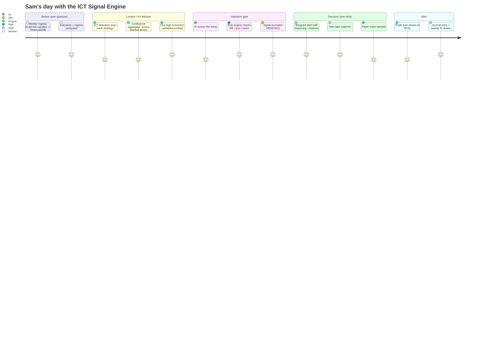
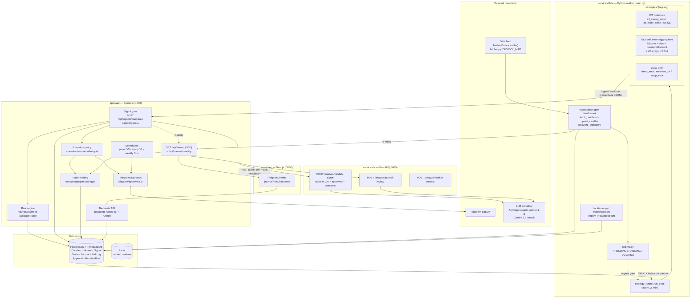
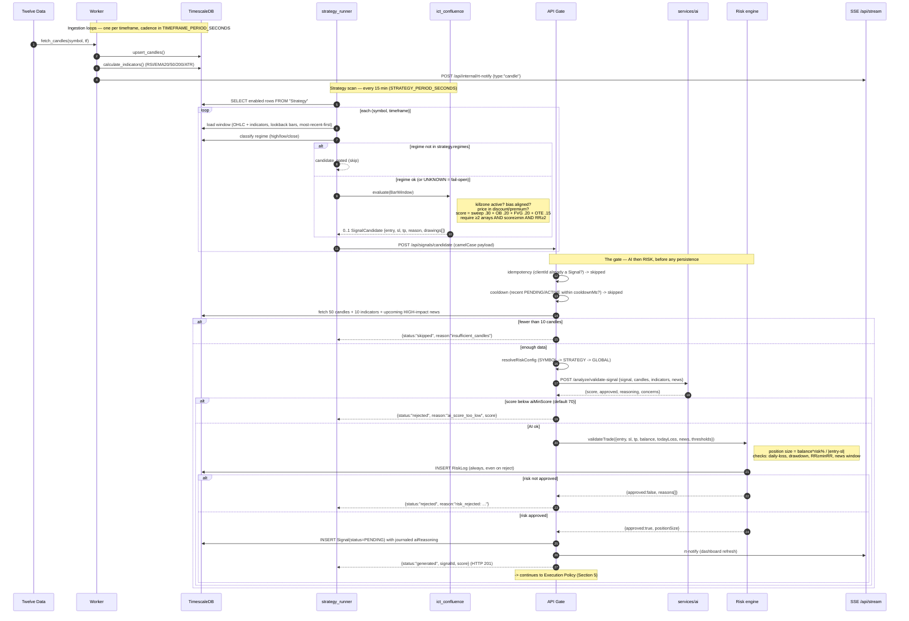
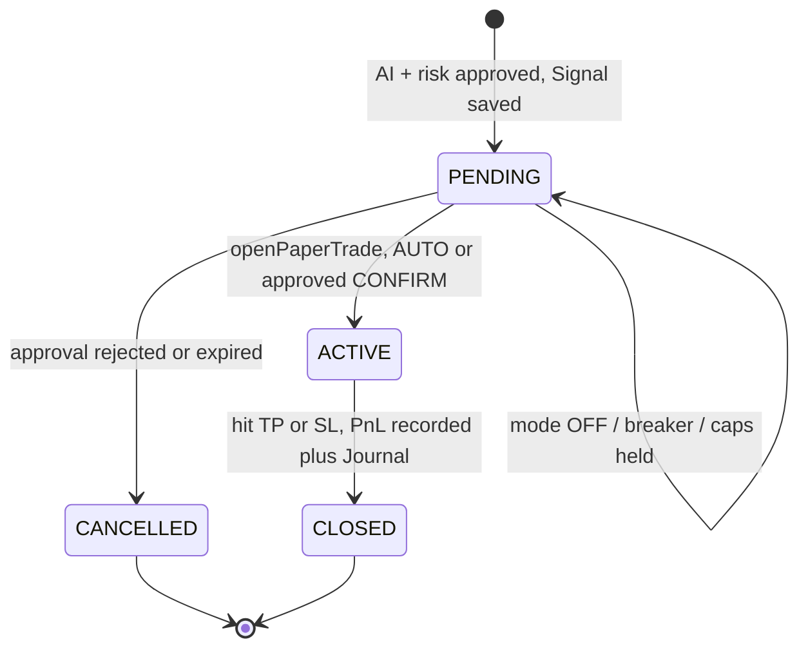
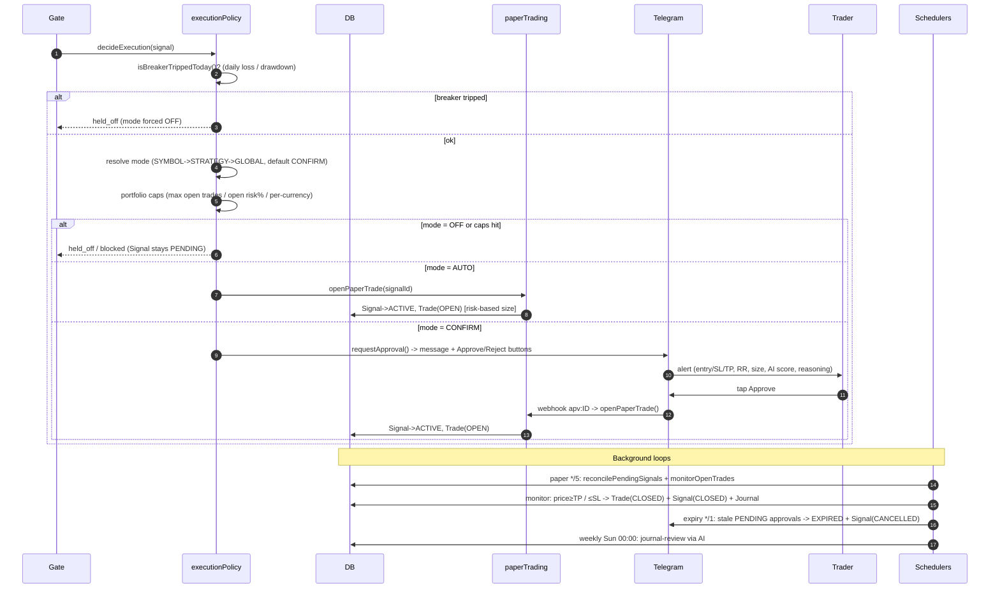
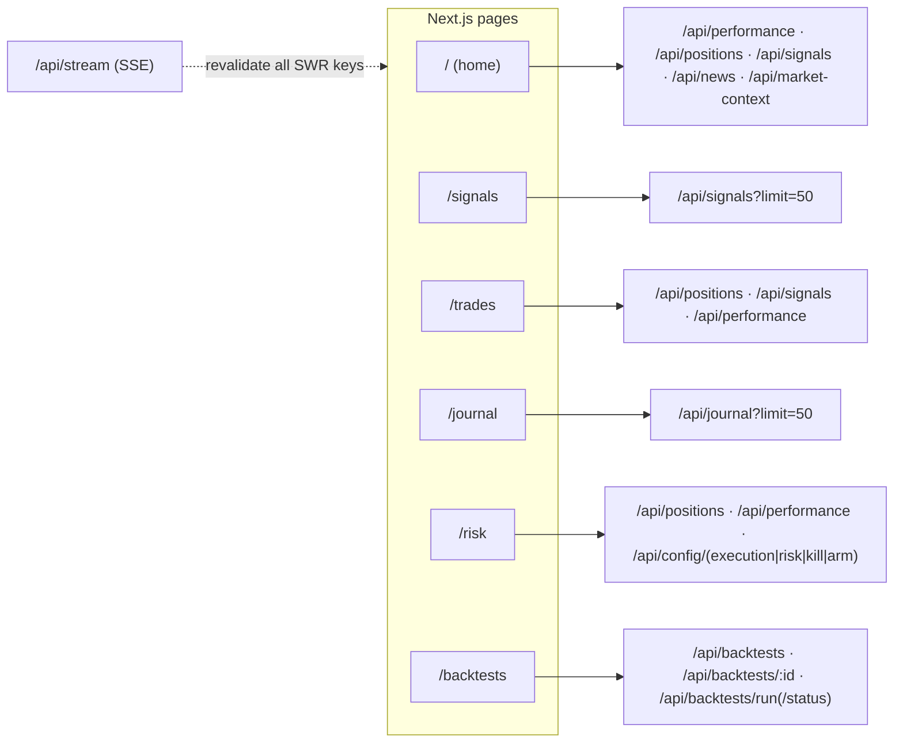
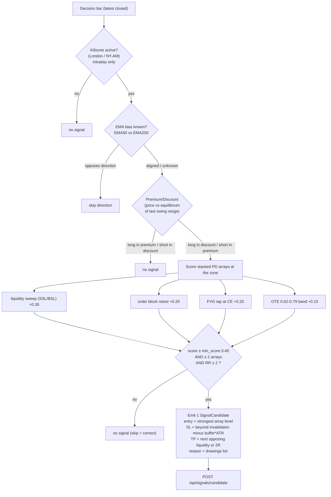

# AI Trading Platform — User Story & System / Signal-Flow Diagrams

**Prepared:** 2026-06-24
**Scope:** End-to-end documentation of how the platform turns raw price data into a journaled, risk-gated, semi-auto-executable trade signal — with the ICT Daily Signal Engine as the signal source.
**Audience:** engineering + product. Every box/arrow below maps to real code (file references inline).

> All Mermaid diagrams render on GitHub and in most Markdown viewers.

---

## 1. User Story

### Primary persona — *Sam, the semi-auto discretionary trader*

> **As a** discretionary FX trader who believes in ICT (liquidity / time / institutional intent) but can't watch the charts all day,
> **I want** the system to independently run each ICT strategy, combine them into **at most one high-conviction EURUSD signal per day**, explain its reasoning, and let me **approve execution with one click**,
> **so that** I only act on A+ setups, never break my own risk rules, and have a full journal to review — without staring at screens during the London/NY killzones.

### Acceptance criteria

| # | Given | When | Then |
|---|-------|------|------|
| 1 | EURUSD candles are flowing | a killzone is active and ≥2 ICT arrays stack in the bias direction inside discount | the engine emits **one** candidate with entry/SL/TP + a human-readable reason |
| 2 | a candidate is produced | it reaches the API gate | it is **AI-validated** *and* **risk-validated** (RR ≥ 2, daily-loss/drawdown/news checks) before it is ever persisted |
| 3 | a signal passes both gates | it is saved | every signal is **journaled with its full reasoning** (`aiReasoning`) — never silently |
| 4 | execution mode = `CONFIRM` | a signal is generated | Sam gets a **Telegram alert with Approve / Reject buttons**; tapping ✅ opens the (paper) trade |
| 5 | execution mode = `OFF` or a circuit breaker is tripped | a signal is generated | **no trade is opened** (the system taking zero trades is correct behaviour) |
| 6 | an open trade hits TP or SL | the 5-minute monitor runs | the trade auto-closes, P&L is recorded, and a **journal entry** is created |
| 7 | Sam opens the dashboard | at any time | he sees live KPIs, positions, signals, the risk engine state, and **backtest results** — updated in near-real-time via SSE |
| 8 | a new strategy is proposed | before it can trade live | it must be **backtested + walk-forward validated** (per `CLAUDE.md`) — surfaced on the `/backtests` page |

### Journey



---

## 2. System Architecture

Four services + Postgres/TimescaleDB + Redis. The web app (`:3100`) talks only to the API (`:4000`); the Python worker pushes candidates **into** the API gate and pings it for realtime fan-out.



---

## 3. Signal Generation — Detailed Flow (the core question: *how does it get a signal?*)

This sequence is the heart of the system: from a freshly-closed candle to a **persisted, journaled `PENDING` signal**. Every step is real code.



### What "a signal" actually contains (journaled)

The persisted `Signal.aiReasoning` stitches **strategy reason + AI verdict + risk outcome** so nothing is unexplained (`gate.ts`):

```
Strategy ict_confluence (LONG):
  Confluence 0.70 (3 arrays): liquidity sweep SSL@1.0832; OB 1.0840-1.0846; FVG 1.0838-1.0844.
  Bias LONG, killzone ny_am, long in discount. Entry 1.0843, SL 1.0808, TP 1.0943 -> RR 2.86.

AI score: 82
AI reasoning: <model assessment>
AI concerns: <...>

Risk approved. Position size 0.01234500 units.
```

---

## 4. Signal Lifecycle (state machine)

`SignalStatus` ∈ `PENDING | ACTIVE | CLOSED | CANCELLED`.



---

## 5. Execution & Delivery Flow (one-click semi-auto)

After persistence the gate calls `decideExecution(signal)` (best-effort — a failure here never rolls back the signal).



**Telegram is the delivery + control plane:** alerts carry the one-click buttons, and commands (`/status`, `/positions`, `/pending`, `/mode auto|confirm|off`, `/kill`, `/arm`) let Sam steer execution from his phone.

---

## 6. Dashboard Data Flow (apps/web :3100 → apps/api :4000)

Near-real-time via **SSE** (`/api/stream`) which triggers SWR cache revalidation (coalesced ~800 ms), backed by conservative polling.



The `/backtests` page is where ICT validation surfaces: `POST /api/backtests/run` spawns `services/data/backtester.py --save-db`, results land in the `BacktestRun` table, and the page renders the per-(strategy,symbol,timeframe) metrics table + `EquityCurve` with a colour-coded verdict (POSITIVE / MARGINAL / NEGATIVE / LOW SAMPLE).

---

## 7. Cadence & timing reference

| Loop | Where | Period | Purpose |
|------|-------|--------|---------|
| Candle ingest (per TF) | `main.py` `TIMEFRAME_PERIOD_SECONDS` | 5–60 min by TF | fetch → upsert → indicators → rt-notify |
| Strategy scan | `main.py` `STRATEGY_PERIOD_SECONDS` | 15 min | run all enabled strategies → POST candidates |
| Paper tick | `scheduler.ts` `PAPER_CRON` | `*/5 * * * *` | reconcile PENDING + monitor/close open trades |
| Approval expiry | `scheduler.ts` `EXPIRY_CRON` | `* * * * *` | expire stale approvals → cancel signal |
| Weekly review | `scheduler.ts` `WEEKLY_CRON` | `0 0 * * 0` | AI behavioural review of closed trades |
| Dashboard SSE | `useRealtime.ts` | event-driven | revalidate SWR on candle/signal events |

---

## 8. The ICT engine in detail (where the signal is *born*)

How `ict_confluence` decides — the gate before the gate (`strategies/ict/confluence.py`, primitives in `strategies/ict/primitives.py`). All geometry is **look-ahead-safe** (swings confirmed `k` bars later; FVGs/OBs reference only closed candles).



> **Status (2026-06-24):** the ICT detectors + aggregator are built and backtested. On EURUSD 60min the aggregator's walk-forward OOS shows PF 1.30 / +0.195R with walk-forward efficiency 1.13 — promising but only 39 OOS trades, **not yet deployable**. The engine currently surfaces on the dashboard as **backtests**; it is not enabled as a live `Strategy` row, and per `CLAUDE.md` it must beat a random baseline + reach a larger sample before going live. See `docs/research/ict-signal-engine-build-plan.md`.

---

## Appendix — key code anchors

| Concern | File |
|---|---|
| Worker orchestration | `services/data/main.py` |
| Strategy driver | `services/data/strategy_runner.py` |
| ICT primitives / aggregator | `services/data/strategies/ict/primitives.py`, `.../confluence.py` |
| Killzones | `services/data/strategies/ict/killzones.py` |
| Signal gate | `apps/api/src/signals/gate.ts` |
| Risk engine | `apps/api/src/risk/riskEngine.ts` |
| Execution policy | `apps/api/src/execution/executionPolicy.ts` |
| Paper trading | `apps/api/src/execution/paperTrading.ts` |
| Telegram approvals | `apps/api/src/telegram/approvals.ts` |
| AI validation | `services/ai/src/main.py` (`/analyze/validate-signal`) |
| Dashboard realtime | `apps/web/lib/useRealtime.ts`, `apps/web/lib/api.ts` |
| Backtests API | `apps/api/src/routes/backtests.routes.ts` |
