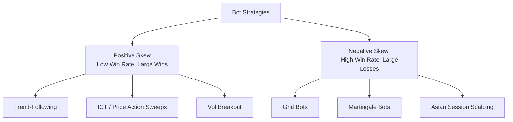

# EUR/USD Bot Trading & Algorithmic Strategies Research Report

This report surveys the characteristics of trading the **EUR/USD** currency pair and analyzes the landscape of automated trading bots (often called Expert Advisors or EAs in the retail space). It contrasts common retail bot strategies (like Grid and Martingale) with institutional and technical concepts (like Trend-Following, Mean Reversion, and ICT/Inner Circle Trader) and details structural recommendations for our AI Trading Intelligence Platform.

---

## 1. EUR/USD as a Trading Instrument

The EUR/USD (Euro vs. US Dollar) is the most heavily traded financial instrument in the world, accounting for roughly **20–28% of global foreign exchange volume**.

### Key Characteristics:
*   **Ultra-Low Spreads:** Due to its massive liquidity, EUR/USD offers the tightest spreads in the FX market (often 0.0 to 0.5 pips on institutional/ECN accounts). This makes it the premier choice for transaction-cost-sensitive strategies like scalping and high-frequency trading.
*   **Average Daily Range (ADR):** Historically, EUR/USD moves between **60 and 90 pips per day**. This limits massive intraday runaways but provides reliable daily fluctuations.
*   **Distinct Session Dynamics:** 
    *   *Asian Session (20:00–00:00 EST):* Typically low volatility and range-bound consolidation.
    *   *London Session Open (02:00–05:00 EST):* Institutional volume floods the market. This session often drives the initial breakout or sweeps the Asian session extremes (the "Judas swing"). London alone handles ~35–40% of daily FX volume.
    *   *New York Open (07:00–10:00 EST):* The overlap between London and NY provides the highest volatility and volume of the day, making it the most active window for breakout and news trading.

---

## 2. Commercial & Retail Bot Trading Archetypes

Retail trading platforms (primarily MetaTrader 4/5) host thousands of commercial and open-source bots. They generally fall into three design categories:

### A. Grid and Martingale Bots (e.g., *Waka Waka EA*, *Happy Frequency*)
Grid and Martingale bots are highly popular in the retail space because their equity curves look exceptionally smooth in backtests.

| Mechanism | Description | Risk Profile |
| :--- | :--- | :--- |
| **Grid Bot** | Places buy/sell orders at regular intervals (e.g., every 15 pips) above and below a baseline. It does not use a hard stop-loss; instead, it waits for the market to swing back to close the basket in profit. | High drawdown during strong trends; requires stable range-bound markets. |
| **Martingale Bot** | Doubles the trade size every time the market moves against the position (e.g., 0.01 lot $\rightarrow$ 0.02 lot $\rightarrow$ 0.04 lot $\rightarrow$ 0.08 lot). | **Negative Skew (High Win-Rate / Tail Risk):** Many small wins punctuated by a single, catastrophic account blow-up. |

> [!WARNING]
> **The Grid/Martingale Trap:** These bots function as *unhedged short-volatility exposure*. In low-volatility or range-bound conditions, they can run for months or years profitably. However, during a structural regime shift (such as the August 2024 JPY carry unwind or major macroeconomic news), they will accumulate massive drawdown and eventually trigger margin calls, wiping out the account.

### B. High-Frequency Scalping Bots (e.g., *Wall Street Forex Robot*)
Scalpers target very small price movements (5 to 15 pips) and hold trades for seconds to minutes.
*   **Execution Sensitivity:** Highly dependent on ultra-low latency, Virtual Private Servers (VPS) co-located near broker servers, and ECN/Raw-spread accounts. A slippage of just 0.5 pips can completely erase a scalping bot's edge.
*   **Time Gating:** Many scalping bots operate strictly during quiet sessions (e.g., late Asian session or late US session) when price moves are predictable and range-bound, using mean-reversion rules (like RSI or Bollinger Band bounces).

### C. Breakout & Session-Open Bots
These bots wait for price to compress into a range and trade the breakout, expecting volatility expansion.
*   **London Breakout:** Automatically calculates the high and low of the Asian session and places buy-stop and sell-stop pending orders just outside the range.
*   **Whipsaw Mitigation:** Because fakeouts (where price briefly breaks a level and reverses) occur frequently, these bots often incorporate volume filters (like average volume comparison) or momentum filters (like ADX > 20) before executing.

---

## 3. Comparing Bot Trading Archetypes

To choose the right bot design, we must understand the fundamental trade-off between **Win Rate** and **Risk/Reward (R:R) Ratio**:

| Metric / Feature | Trend-Following & ICT (Positive Skew) | Grid & Martingale (Negative Skew) | Scalping (Mean Reversion) |
| :--- | :--- | :--- | :--- |
| **Typical Win Rate** | ~30% – 45% | ~75% – 95% | ~60% – 75% |
| **Reward:Risk Ratio** | 2:1 to 5:1 | Asymmetric (e.g., risking 10 to make 1) | 1:1 to 1.5:1 |
| **Best Market Regime** | Trending, Volatility Expansion | Range-bound, Consolidated, Quiet | Low-volatility, range-bound |
| **Worst Market Regime** | Choppy, ranging sideways markets | Strong, persistent trends | News events, trend shifts |
| **Risk Management** | Hard Stop-Loss (1-2% risk per trade) | No SL / Recovery Grid / Basket Sizing | Tight SL + Time-based exits |

---

## 4. Key Recommendations for our Platform

Based on this research, we should prioritize specific design elements in our **AI Trading Intelligence Platform**:

### 1. Reject Martingale and Unhedged Grid Mechanics
To ensure long-term profitability and align with professional prop firm rules, our system should strictly enforce:
*   **Dynamic Stop-Losses:** Stop-losses should be calculated using the Average True Range (ATR) (e.g., $1.5 \times \text{ATR}$ or $2.0 \times \text{ATR}$).
*   **Risk-Based Sizing:** Position size must be derived dynamically from account equity:
    $$\text{Position Size (Lots)} = \frac{\text{Account Equity} \times \text{Risk \%}}{\text{Stop Loss in Pips} \times \text{Pip Value}}$$

### 2. Implement Regime Detection as a Gateway
Since trend-following and mean-reversion strategies succeed in completely opposite market conditions, our **FastAPI AI Service (`services/ai`)** should run a daily regime classifier:
*   **Trend/Breakout Mode:** Enabled when **ADX > 20** and Bollinger Bands are expanding.
*   **Mean-Reversion/Range Mode:** Enabled when **ADX < 20** and price is oscillating within a stationary channel (verified via Augmented Dickey-Fuller stationarity tests).

### 3. Incorporate Liquidity & Time-of-Day Gating (ICT)
Instead of relying solely on lagging indicators (like moving averages), our bot engine should integrate the concepts from [ict-concepts.md](file:///Users/microstore/CambotixSolutions/ai-trading-platform/docs/research/ict-concepts.md):
*   **Liquidity Sweeps:** Focus entries after the market has swept buy-side or sell-side liquidity at key session highs/lows.
*   **Killzone Restricting:** Limit trading signals strictly to session opens (e.g., London Open or NY Open) when institutional order flow is strongest.

### 4. Setup a Demo / Incubation Process
Per our platform rules in `CLAUDE.md`:
*   *Backtest before live use:* Backtest each strategy over at least 200+ historical trades with 1.5x simulated transaction costs to account for slippage.
*   *Paper trade before real money:* Integrate the **OANDA practice API** as our default broker connection to trade paper accounts before committing real funds.

---

## Sources & References

1. **Waka Waka & Grid Bot Analysis:** [New York City Servers — Forex EAs Guide](https://newyorkcityservers.com/blog/)
2. **Algorithmic Trading & FX Dynamics:** [OANDA API Documentation](https://developer.oanda.com/)
3. **Forex Market Structures:** Brunnermeier, Nagel & Pedersen (2008), *Carry Trades and Currency Crashes*, NBER.
4. **Adaptive Market Hypothesis:** Park & Irwin (2007), *What Do We Know About the Profitability of Technical Analysis?*, Wiley.
5. **Inner Circle Trader Concepts:** [ICT Concepts Research Report](file:///Users/microstore/CambotixSolutions/ai-trading-platform/docs/research/ict-concepts.md)
