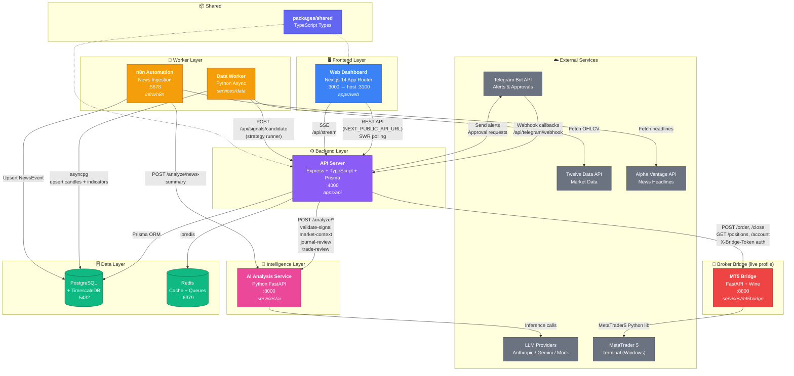
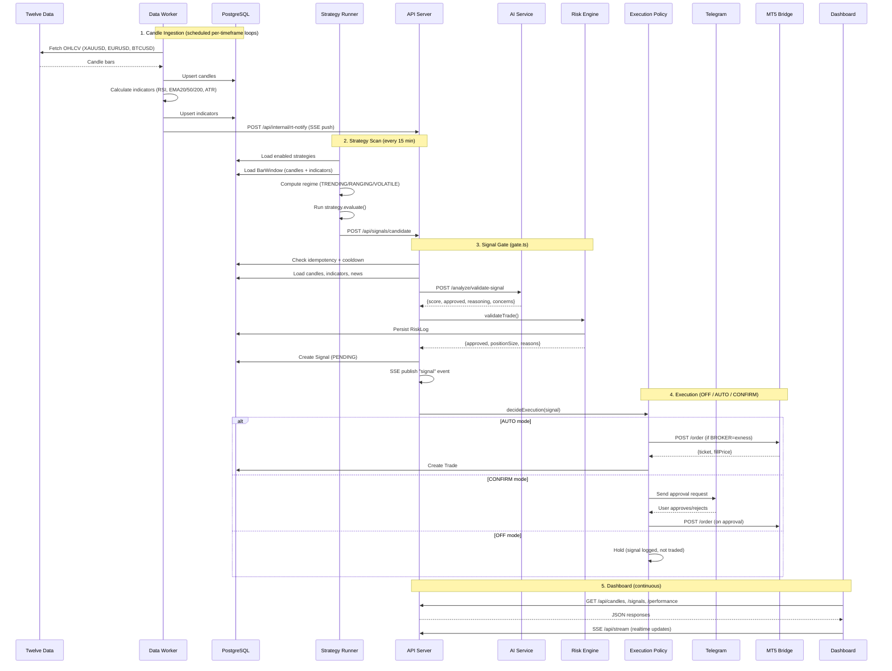
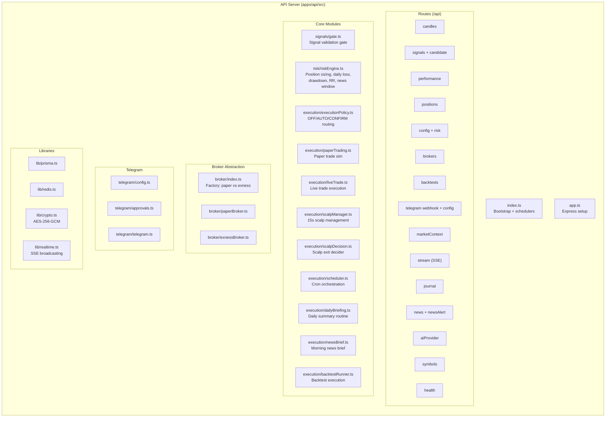
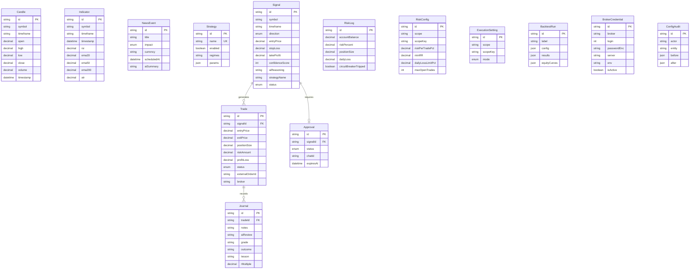
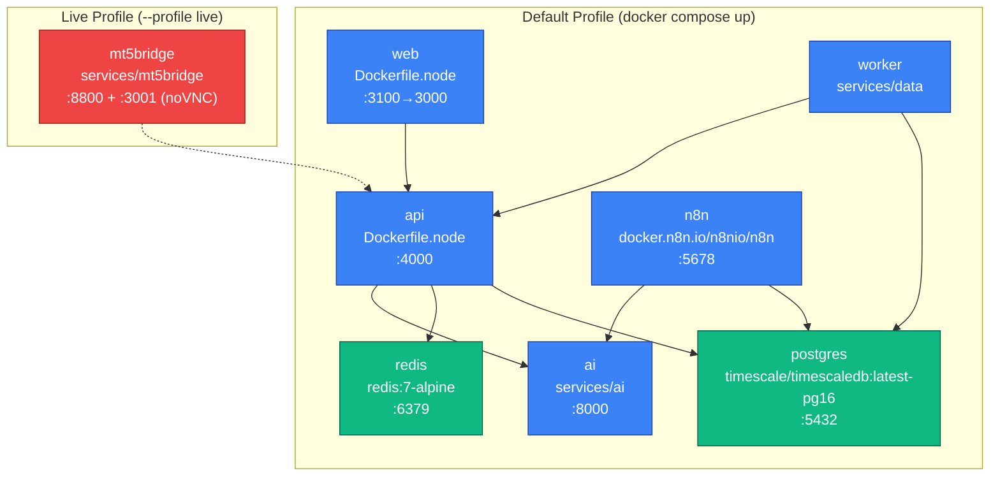

# AI Trading Platform — System Architecture & Code Review

> **⚠️ HISTORICAL SNAPSHOT — superseded on 2026-08-28.**
>
> This document describes the architecture *before* the Next.js + Python
> consolidation (`docs/plans/11-nextjs-python-consolidation.md`). It still shows
> an Express API at `:4000` as the main backend and a separate AI service at
> `services/ai`, neither of which is how the platform runs now:
>
> - The trading domain moved to **`services/backend`** (FastAPI).
> - **`services/ai` has been deleted**; its code is `services/backend/app/integrations/ai`.
> - **`apps/api`** is the legacy rollback path only, behind the `legacy` compose profile.
> - The browser calls **same-origin `/api/*`** on Next.js, which proxies to the backend.
>
> For the current architecture see **`docs/ARCHITECTURE.md`**. The code-review
> findings below are kept as a record of what was true at the time.

## System Architecture Diagram

---

## Detailed Data Flow Diagram

---

## Component Architecture

---

## Database Schema (Prisma)

---

## Docker Compose Service Map

---

## Trading Strategies

| Strategy | File | Type | Regimes |
|----------|------|------|---------|
| `trend_ema` | [trend_ema.py](file:///Users/microstore/CambotixSolutions/ai-trading-platform/services/data/strategies/trend_ema.py) | Trend following | TRENDING |
| `meanrev_rsi` | [meanrev_rsi.py](file:///Users/microstore/CambotixSolutions/ai-trading-platform/services/data/strategies/meanrev_rsi.py) | Mean reversion | RANGING |
| `scalp_ema` | [scalp_ema.py](file:///Users/microstore/CambotixSolutions/ai-trading-platform/services/data/strategies/scalp_ema.py) | Scalping | TRENDING |
| `scalp_vwap` | [scalp_vwap.py](file:///Users/microstore/CambotixSolutions/ai-trading-platform/services/data/strategies/scalp_vwap.py) | VWAP scalping | TRENDING |
| ICT strategies | [strategies/ict/](file:///Users/microstore/CambotixSolutions/ai-trading-platform/services/data/strategies/ict) | Price action | Various |

---

## Code Review

### ✅ Strengths

| Area | Details |
|------|---------|
| **Architecture** | Clean monorepo separation: `apps/`, `services/`, `packages/shared`. Each concern (ingestion, AI, execution, UI) is isolated in its own service |
| **Risk Discipline** | The `gateCandidate()` function enforces a **mandatory** AI validation → risk engine → execution policy pipeline. No bypass path exists |
| **Execution Modes** | Three-mode execution policy (OFF/AUTO/CONFIRM) with Telegram human-in-the-loop approval. Scoped at GLOBAL/STRATEGY/SYMBOL granularity |
| **Broker Abstraction** | Clean `PaperBroker` / `ExnessBroker` interface with symbol-map translation. Live profile behind Docker `--profile live` |
| **Idempotency** | Signal gate handles duplicate `clientId` and cooldown windows. MT5 bridge checks `clientTag` before opening duplicate positions |
| **Regime Gating** | Strategy runner classifies market regime (TRENDING/RANGING/VOLATILE) and gates strategies against their declared regimes |
| **Audit Trail** | `ConfigAudit` table records every config change with actor + before/after JSON diff. `RiskLog` persists every risk check |
| **Credential Security** | Broker passwords stored AES-256-GCM encrypted at rest ([crypto.ts](file:///Users/microstore/CambotixSolutions/ai-trading-platform/apps/api/src/lib/crypto.ts)) |
| **Learning Loop** | Closed trades get AI-reviewed (`/analyze/trade-review`) with grade (A–F), R-multiple, and lesson — compounding discipline |

---

### ⚠️ Issues & Recommendations

#### 🔴 Critical

| # | Issue | Location | Recommendation |
|---|-------|----------|----------------|
| 1 | **Dead code after return** — `provider_test()` has a `return` statement on line 142 that is **unreachable** after the `return TestResult(...)` on line 141 | [main.py:141-142](file:///Users/microstore/CambotixSolutions/ai-trading-platform/services/ai/src/main.py#L141-L142) | Remove the dead `return ProviderState(...)` on line 142 |
| 2 | **No authentication on API** — The Express API has no auth middleware. All endpoints (`/api/signals`, `/api/config`, `/api/brokers`) are open. `JWT_SECRET` is defined in `.env.example` but never used | [app.ts](file:///Users/microstore/CambotixSolutions/ai-trading-platform/apps/api/src/app.ts) | Add JWT or API key middleware, at minimum to mutation endpoints |
| 3 | **Paper account state from env vars** — Account balance/peak are read from `PAPER_ACCOUNT_BALANCE` env var, not tracked in DB. Risk calculations use stale values after trades run | [gate.ts:62-69](file:///Users/microstore/CambotixSolutions/ai-trading-platform/apps/api/src/signals/gate.ts#L62-L69) | Derive running balance from `SUM(profitLoss)` on closed trades or maintain an `Account` table |
| 13 | **Duplicate `readAccountState()` / `readAccount()` functions** | [gate.ts:62](file:///Users/microstore/CambotixSolutions/ai-trading-platform/apps/api/src/signals/gate.ts#L62) & [executionPolicy.ts:31](file:///Users/microstore/CambotixSolutions/ai-trading-platform/apps/api/src/execution/executionPolicy.ts#L31) | Consolidate logic into a single shared helper inside a common module to prevent settings drift. |
| 14 | **`computeTodayLoss()` duplicate queries** | [gate.ts:71](file:///Users/microstore/CambotixSolutions/ai-trading-platform/apps/api/src/signals/gate.ts#L71) & [executionPolicy.ts:43](file:///Users/microstore/CambotixSolutions/ai-trading-platform/apps/api/src/execution/executionPolicy.ts#L43) | Consolidate into a single module to ensure the gate and circuit breaker use the same calculations. |
| 15 | **Circuit breaker drawdown uses static balance base** | [executionPolicy.ts:71-75](file:///Users/microstore/CambotixSolutions/ai-trading-platform/apps/api/src/execution/executionPolicy.ts#L71-L75) | Real balance base updates are ignored, leading to circuit breaker calculation inaccuracies. |

#### 🟡 Important

| # | Issue | Location | Recommendation |
|---|-------|----------|----------------|
| 4 | **Threading lock in async context** — MT5 bridge uses `threading.Lock()` inside `async def` FastAPI endpoints. This blocks the event loop and limits throughput | [app.py:45](file:///Users/microstore/CambotixSolutions/ai-trading-platform/services/mt5bridge/app.py#L45) | Use `asyncio.Lock` or `run_in_executor` to avoid blocking the async event loop |
| 5 | **No rate limiting** — The API has no rate limiting. Since it accepts external candidates via `POST /api/signals/candidate`, this is an open attack surface | [routes/signals.routes.ts](file:///Users/microstore/CambotixSolutions/ai-trading-platform/apps/api/src/routes/signals.routes.ts) | Add `express-rate-limit` middleware |
| 6 | **Global mutable state for MT5 creds** — `session_login()` mutates module-level `MT5_LOGIN`, `MT5_PASSWORD`, `MT5_SERVER` via `global` keyword. Not safe across concurrent requests | [app.py:177](file:///Users/microstore/CambotixSolutions/ai-trading-platform/services/mt5bridge/app.py#L177) | Wrap in a dataclass; the lock already serializes, but explicit state is cleaner |
| 7 | **Twelve Data rate limit risk** — The worker exceeds the 800 req/day free tier after ~13 hours, as the code itself notes. Continuous running will start failing silently | [main.py:29-31](file:///Users/microstore/CambotixSolutions/ai-trading-platform/services/data/main.py#L29-L31) | Add explicit daily request counting + backoff, or upgrade API tier |
| 8 | **No graceful shutdown in data worker** — `main.py` runs `asyncio.gather()` but has no signal handler for SIGTERM. Docker sends SIGTERM on `compose down`, so the worker gets killed mid-write | [main.py:126-151](file:///Users/microstore/CambotixSolutions/ai-trading-platform/services/data/main.py#L126-L151) | Add a signal handler to cancel the gather and run `close_pool()` cleanly |
| 16 | **No health check on data worker** | [docker-compose.yml:138-155](file:///Users/microstore/CambotixSolutions/ai-trading-platform/docker-compose.yml#L138-L155) | Add a standard healthcheck option to ensure auto-restarts on network drop or fatal loop failure. |
| 17 | **`_ensure_connected()` locks on every call** | [app.py:51-67](file:///Users/microstore/CambotixSolutions/ai-trading-platform/services/mt5bridge/app.py#L51-L67) | Run checking in a background thread or connection pool loop, rather than blocking the serialize lock on every inbound endpoint check. |
| 18 | **`maxTradesPerDay` missing from `RISK_FIELDS` resolver** | [resolve.ts:21-33](file:///Users/microstore/CambotixSolutions/ai-trading-platform/apps/api/src/config/resolve.ts#L21-L33) | Add the parameter to `RISK_FIELDS` so scope overrides (symbol, strategy) can actually take effect. |
| 19 | **Reconciler sweep does not limit signal age** | [executionPolicy.ts:196](file:///Users/microstore/CambotixSolutions/ai-trading-platform/apps/api/src/execution/executionPolicy.ts#L196) | Add a timeframe limit (e.g. `createdAt > now - TTL`) to check only relevant pending signals. |

#### 🟢 Minor / Polish

| # | Issue | Location | Recommendation |
|---|-------|----------|----------------|
| 9 | **`.env` committed to git** | Root & service directories | **[RESOLVED/FALSE POSITIVE]** Already ignored in `.gitignore`, no files are tracked. |
| 10 | **Missing TypeScript strict mode** | [tsconfig.base.json](file:///Users/microstore/CambotixSolutions/ai-trading-platform/tsconfig.base.json) | **[RESOLVED/FALSE POSITIVE]** already has `"strict": true` and `"noUncheckedIndexedAccess": true`. |
| 11 | **Backtest data modules scattered** — `backtester.py`, `backfill_history.py`, `prepare_backtest.py`, `walkforward.py`, `baseline_mc.py`, `frame_sweep.py` are all top-level in `services/data/` | [services/data/](file:///Users/microstore/CambotixSolutions/ai-trading-platform/services/data) | Move into a `services/data/backtest/` subpackage for clarity |
| 12 | **CORS wide open** — `cors()` with no options allows any origin. Fine for dev, risky in production | [app.ts:13](file:///Users/microstore/CambotixSolutions/ai-trading-platform/apps/api/src/app.ts#L13) | Configure `origin` allowlist from env: `cors({ origin: process.env.CORS_ORIGIN })` |
| 20 | **In-function python imports** | [app.py:346](file:///Users/microstore/CambotixSolutions/ai-trading-platform/services/mt5bridge/app.py#L346) & [app.py:368](file:///Users/microstore/CambotixSolutions/ai-trading-platform/services/mt5bridge/app.py#L368) | Move standard imports (like `import time`) to the top level of the file. |
| 21 | **No request timeout on AI service call** | [gate.ts:170-173](file:///Users/microstore/CambotixSolutions/ai-trading-platform/apps/api/src/signals/gate.ts#L170-L173) | Supply an `AbortSignal.timeout(...)` to prevent indefinite blocking if the LLM/provider lags. |
| 22 | **Truncated SHA-1 modulo for MT5 magic number** | [app.py:80](file:///Users/microstore/CambotixSolutions/ai-trading-platform/services/mt5bridge/app.py#L80) | Keep an eye on potential tag collisions due to the `% 2_000_000_000` truncation. |

---

### 📊 Codebase Statistics

| Metric | Value |
|--------|-------|
| Languages | TypeScript, Python, SQL |
| Monorepo Workspaces | 2 apps (`web`, `api`) + 1 package (`shared`) |
| Docker Services | 7 (default) + 1 (live profile) |
| API Routes | 16 route modules |
| Prisma Models | 14 |
| Trading Strategies | 5+ (pluggable registry) |
| Scheduled Jobs | Paper trade (5m), Scalp (15s), Weekly review (Sun), Daily briefing (6:00 UTC), Approval expiry (1m) |
| External Integrations | Twelve Data, Alpha Vantage, Telegram, MetaTrader 5, LLM providers, n8n |
